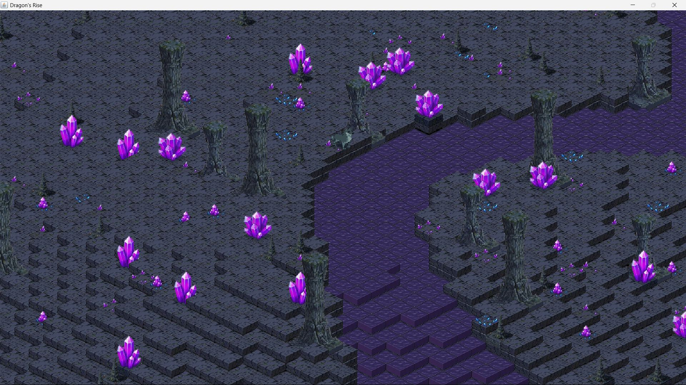
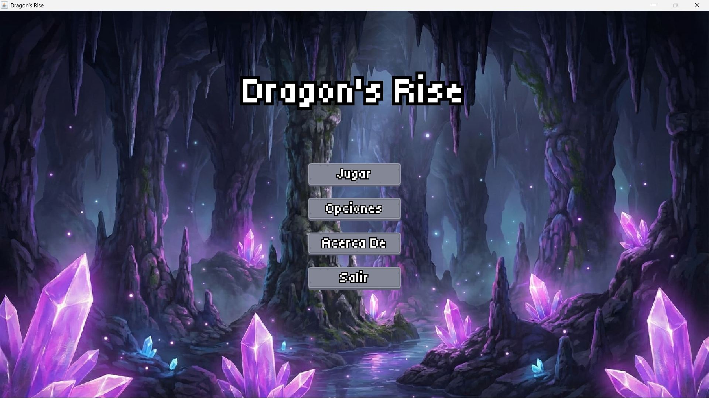

# Dragon's Rise - Prototipo de Videojuego 2D

<p align="center">
  
  &nbsp; &nbsp;
  
</p>

**Lenguaje:** Java  
**Licencia:** GPL v3

**Resumen:** Prototipo de videojuego 2D isométrico desarrollado enteramente en **Java puro (JDK 21)**. El objetivo principal del proyecto es demostrar la implementación de una **Arquitectura Hexagonal** sólida y un motor gráfico propio sin librerías externas.
> **Nota de desarrollo:** Aunque el título es *Dragon's Rise*, esta versión prototipo utiliza un avatar de lobo para las pruebas de mecánicas y animación.

## Características
- **Arquitectura Hexagonal:** Separación estricta entre lógica de dominio, aplicación e infraestructura.
- **Motor de Física Newtoniana:** Implementación propia de fuerzas, aceleración, velocidad y fricción.
- **Sistema de Renderizado Isométrico:** Soporte para tiles y mapas con perspectiva isométrica.
- **Gestión de Estados de Juego:** Sistema robusto para transiciones entre Menús, Niveles y otros estados.
- **Sistema de UI Personalizado:** Componentes de interfaz (Botones, Etiquetas) construidos con patrones de diseño.
- **Animaciones y Sprites:** Sistema de caché de sprites y gestión de frames de animación.
- **Input Multi-backend:** Abstracción de controles adaptable a diferentes plataformas (actualmente Desktop).

## Requisitos
- **Java Development Kit (JDK):** Versión 21 o superior.

## Estructura del Proyecto
```
src
├── core
│   ├── config          # Configuración global
│   ├── loop            # Game Loop principal
│   ├── math            # Vectores y utilidades matemáticas
│   ├── memory          # Gestión de memoria (Object Pools)
│   └── physics         # Motor de física (Newtonian)
├── features
│   ├── entities        # Actores del juego (Player, NPCs)
│   ├── gamestates      # Estados (Menu, Level)
│   ├── tile            # Sistema de mapas y tiles
│   ├── ui              # Interfaz de usuario
│   ├── view            # Sistema de fijación de Cámara sobre el jugador
│   └── world           # Sistema de renderizado mundial
├── launcher            # Punto de entrada (Main)
└── platform
    └── desktop         # Implementaciones específicas de escritorio
```

## Arquitectura y Patrones
El proyecto sigue una **Arquitectura Hexagonal**, organizando el código en capas concéntricas:
- **Domain:** Contiene las reglas de negocio y modelos puros (`GameEntity`, `GameState`). No tiene dependencias externas.
- **Application:** Orquesta los casos de uso y conecta el dominio con la infraestructura (`PlayerController`, `IsometricTileRenderer`).
- **Infrastructure:** Implementaciones concretas de interfaces del dominio (`WordlRendererState`, `DesktopInputAdapter`, `PlayerRenderer`).

### Patrones de Diseño Identificados
- **Singleton:** `GameStateManager` (Gestión única del estado global del juego).
- **Object Pool:** `Vector2dPool` (Reutilización de objetos vectoriales para optimizar memoria).
- **Builder:** `ButtonBuilder`, `LabelBuilder` (Construcción fluida de componentes de UI).
- **State:** `GameState` (Permite cambiar el comportamiento del juego según el estado actual: `MainMenuState`, `CrystalCaveLevel`).
- **Strategy:** `PhysicsSystem` (Permite intercambiar implementaciones de física, ej. `NewtonianPhysics`).
- **Repository:** `SpriteRepository`, `TileRepository` (Abstracción del acceso a datos y assets).
- **Adapter:** `DesktopInputAdapter` (Adapta los eventos de teclado de AWT a la interfaz de dominio `InputController`).
- **Game Loop:** `GameLoop` (Patrón fundamental para el ciclo de actualización y renderizado).

## Cómo Ejecutar
El punto de entrada principal es la clase `launcher.GameLauncher`.

**Desde terminal:**
```bash
# Compilar
javac -d out -sourcepath src src/launcher/GameLauncher.java

# Ejecutar
java -cp out launcher.GameLauncher
```


## Controles

### Teclado

| Acción | Teclas |
|--------|--------|
| **Mover Norte** | `W` o `↑` |
| **Mover Sur** | `S` o `↓` |
| **Mover Este** | `D` o `→` |
| **Mover Oeste** | `A` o `←` |
| **Atacar** | `SPACE` |

### Mouse

- **Click Izquierdo:** Interacción con elementos UI
- **Movimiento:** Navegación de menús

## Licencia
Este proyecto se distribuye bajo los términos especificados en el archivo `LICENSE`.